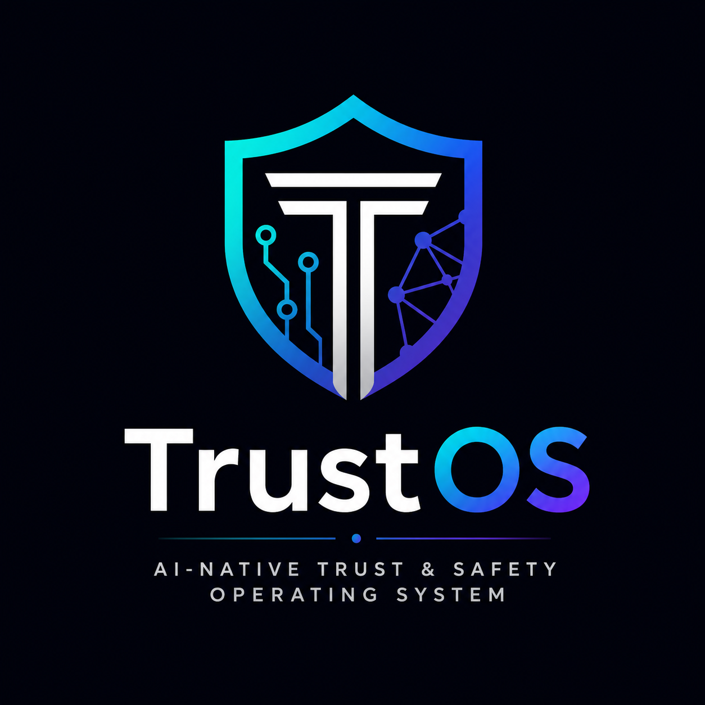
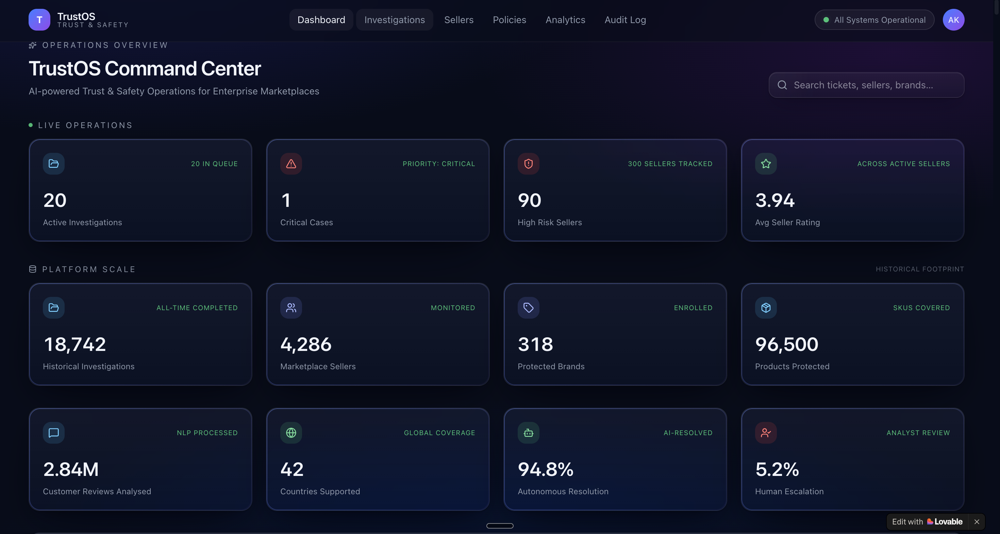

<div align="center">



# TrustOS

### Enterprise AI-Native Trust & Safety Operating System

#### Autonomous Multi-Agent AI for Explainable Trust & Safety Investigations

<br>

 
 
 
 
 

<br>

<a href="https://risk-arbiter.lovable.app">
    
        
</a>

<a href="docs/TRUSTOS_Whitepaper.pdf">
    
        
</a>

<a href="docs/TrustOS_pitch_deck.pdf">
    
        
</a>

</div>

---
> **TrustOS transforms manual Trust & Safety investigations into autonomous, explainable, and enterprise-governed AI workflows.**
>
> Built for marketplaces, e-commerce, fintech, social platforms, and digital ecosystems, TrustOS orchestrates specialised AI agents to analyse evidence, interpret policy, assess risk, and generate transparent recommendations while keeping humans in control of high-impact decisions.

---

## Executive Summary

TrustOS orchestrates specialised AI agents to automate Trust & Safety investigations from evidence collection through explainable decision recommendations.

Built for marketplaces, e-commerce, fintech and digital platforms, TrustOS combines autonomous AI reasoning with human governance to improve investigation quality, consistency and auditability.

## The Problem

Modern Trust & Safety operations rely on fragmented tools, manual investigations and disconnected policy knowledge.

Key challenges:

- Reviewing thousands of cases consistently
- Correlating evidence across multiple systems
- Applying policies uniformly across investigations
- Producing transparent, explainable decisions
- Maintaining audit-ready governance
- Reducing investigation turnaround time without compromising quality

## Meet TrustOS

TrustOS augments investigators with specialised AI agents for evidence analysis, policy interpretation, vision analysis, risk assessment and executive reporting.

Every recommendation is explainable, traceable and auditable.

## Architecture


```text

Marketplace Event
        │
        ▼
 Investigation Portal
        │
 ┌──────┼────────┐
 ▼      ▼        ▼
Evidence Policy Vision
 Agent    Agent   Agent
        │
        ▼
Autonomous Risk Council
        │
        ▼
Compliance Decision Engine
        │
        ▼
Human Review (High-Risk Cases)
        │
        ▼
Executive Report & Audit Log
```
## Product Screenshots

### Dashboard



### Investigation Queue


### Analytics


## Technology Stack

| Layer | Technology |
|---|---|
| Workflow Automation | n8n |
| LLM| OpenAI GPT|
| Frontend | Lovable |
| Data Store | Google Sheets |
| Architecture | Multi-Agent AI

## Key Features

- Multi-Agent AI
- Explainable AI
- Human-in-the-loop
- Policy reasoning
- Evidence analysis
- Executive reporting
- Audit trail

## Business Value

- Faster investigation turnaround
- Consistent policy enforcement
- Explainable AI recommendations
- Human-in-the-loop governance
- Enterprise-grade auditability
- Scalable Trust & Safety operations

## Repository Structure

```text
assets/
demo/
docs/
workflow/
LICENSE
README.md
```

## Resources

- 🚀 **Live Demo:** https://risk-arbiter.lovable.app/
- 📄 **Whitepaper:** [TRUSTOS_Whitepaper.pdf](docs/TRUSTOS_Whitepaper.pdf)
- 📊 **Pitch Deck:** [TrustOS_pitch_deck.pdf](docs/TrustOS_pitch_deck.pdf)
  
## Roadmap

- Additional AI agents
- Enterprise integrations
- Advanced analytics
- Workflow templates

## License

Apache-2.0

## Creator

**Aniruddha Vanshiv**

Trust & Safety • AI • Platform Risk • Customer Experience

---

⭐ If you found this project interesting, please consider starring the repository.

TrustOS demonstrates how autonomous multi-agent AI can transform enterprise Trust & Safety investigations through explainable reasoning, governance, and human oversight.
